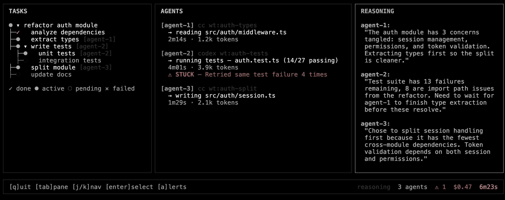

# oswarm

Tasteful multi-agent conductor. Spawns fleets of coding agents, orchestrates them with taste, and shows you everything in real-time.



## What it does

oswarm coordinates dozens of AI coding agents (Claude Code, Codex, OpenClaw — anything speaking ACP) across isolated worktrees. It decomposes goals, routes tasks, runs Ralph Loop review cycles between agents, detects when agents are stuck or spinning, and surfaces reasoning traces so you can see *why* agents made the decisions they did.

The key differentiator: **taste**. The orchestrator encodes judgment about when to decompose, how to structure feedback loops, what context to inject, and when to stop. It's the portable, reusable version of [harness engineering](https://openai.com/index/harness-engineering/).

## Install

```bash
bun install
```

## Usage

```bash
# Live dashboard — watch your swarm work
bun run cli.ts watch

# Demo mode
bun run cli.ts watch --demo

# Run a goal
bun run cli.ts run "refactor auth module"

# Bootstrap harness in any repo
bun run cli.ts init
```

## TUI

Three-pane terminal dashboard. Task tree on the left, agent activity in the center, reasoning stream on the right.

| Key | Action |
|-----|--------|
| `Tab` | Switch panes |
| `j`/`k` | Navigate |
| `Enter` | Expand/collapse, open alert actions |
| `a` | Jump to next alert |
| `q` | Quit |

### Alerts

Heuristic anomaly detection runs continuously:

| Pattern | Trigger |
|---------|---------|
| Stuck loop | Same action repeated 4+ times |
| Spinning | 2k+ tokens with no file writes |
| Conflict | Two agents writing same file |
| Stalled | No activity for 60s+ |

When detected, the TUI suggests actions — kill, reassign, hint, or ignore. You decide.

## Architecture

```
Types → Config → Providers → Protocol → Engine → Adapters → Skills → CLI
```

### Observer Pipeline

Agents emit NDJSON events to `.oswarm/events/`. The observer pipeline tails these files, reduces them into live state, runs alert detection, and feeds the TUI.

### Adapters

Pluggable backends — each ~200 lines implementing a common interface:

- **Claude Code** via Agent SDK
- **Codex** via ACPX
- **OpenClaw** via ACPX / sessions_spawn
- **Cloud** via Modal (GPU) / Fly.io Machines (networking)

### Skills

AgentSkills-format SKILL.md files installable in Claude Code and OpenClaw. The orchestrator itself is a skill. Publishable to ClawHub.

## License

MIT
